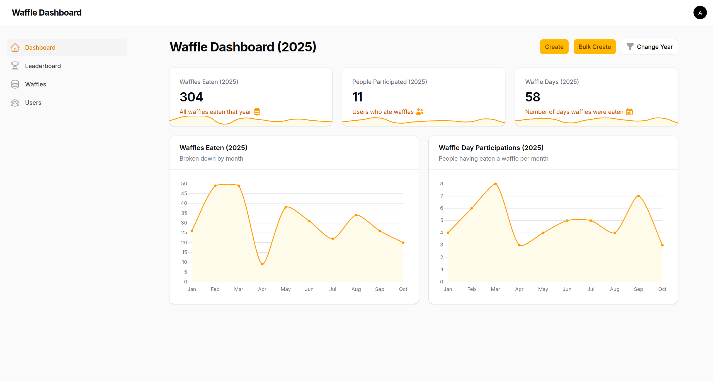

# Waffle Dashboard <!-- omit in toc -->

"Give a man a waffle and he’ll eat for a day. Teach a man to waffle and he’ll never be sad again."

> This project is dedicated to all the amazing companies made up of wonderful people who know how to really waffle it with their employees. Shine bright, one waffle at a time. The world needs more of you.

The Waffle Dashboard is a lightweight, self-hostable application for tracking and celebrating your team/family/friend group's waffle consumption. It provides stats, leaderboards, and input forms to capture waffle-eating achievements.

_Check out the [docs/screenshots](docs/screenshots) folder._

> Please star the repository if you find this project useful - it helps me understand how many people rely on it when making changes.

## Table of Contents <!-- omit in toc -->

- [Get the Waffle Dashboard](#get-the-waffle-dashboard)
- [Software Development Process](#software-development-process)
  - [Requirements Definition](#requirements-definition)
  - [Design (Mockups)](#design-mockups)
  - [Architecture](#architecture)
  - [Implementation](#implementation)
- [Maintenance](#maintenance)
- [Contribution](#contribution)

## Get the Waffle Dashboard

The self-hosted setup is very quick and easy - just follow the **[Waffle Installation Guide](docs/WAFFLE-INSTALLATION-GUIDE.md)**.

If you want to customize the software's style, also consider the **[Custom Waffle Dashboard Guide](docs/CUSTOM-WAFFLE-DASHBOARD-GUIDE.md)**.

## Software Development Process

For this project, I opted for a variant of the classic waterfall model, which can be found, for example, in Ian Sommerville's well-known book [“Software Engineering, 9th edition, 2010: p.10](https://engineering.futureuniversity.com/BOOKS%20FOR%20IT/Software-Engineering-9th-Edition-by-Ian-Sommerville.pdf#page=47)”.

The Markdown documents for the [Requirements Definition](#requirements-definition) and [Architecture](#architecture) phases are based on the [version 1.1.1 of the ADF documentation template](https://github.com/architecture-decomposition-framework/adf-documentation-template/blob/main/template/architecture-documentation-en.md), which belongs to the [Architecture Decomposition Framework (ADF)](https://www.iese.fraunhofer.de/blog/softwarearchitekturen-einfacher-designen-und-verstaendlicher-dokumentieren-mit-dem-fraunhofer-adf/) developed by [Fraunhofer IESE](https://www.iese.fraunhofer.de/en/aboutus.html#:~:text=The%20Fraunhofer%20Institute%20for%20Experimental,engineering%20for%20almost%2030%20years.).

> Starting on Oct 31 2025 (from [IMPLEMENTATION.md step 21](docs/4_IMPLEMENTATION.md#21-add-waffle-day-events) onward), additional application features were managed via [GitHub Issues](https://github.com/lchristmann/waffle-dashboard/issues).
> Their additions therefore do not appear in the first three documents below.

### Requirements Definition

See [docs/1_REQUIREMENTS.md](docs/1_REQUIREMENTS.md).

### Design (Mockups)

See [docs/2_DESIGN.md](docs/2_DESIGN.md).

### Architecture

See [docs/3_ARCHITECTURE.md](docs/3_ARCHITECTURE.md).

### Implementation

See [docs/4_IMPLEMENTATION.md](docs/4_IMPLEMENTATION.md).

## Maintenance

This project actively maintained by [me](https://github.com/lchristmann).

For questions or support, just [email me](mailto:hello@lchristmann.com).

## Contribution

See the [Contribution Guide](docs/CONTRIBUTION-GUIDE.md) and the [Developer Docs](DEVELOPER-DOCS.md).
