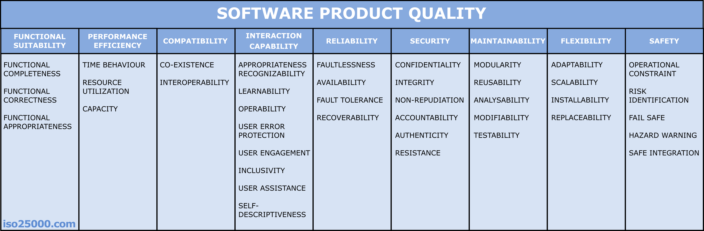

# Requirements <!-- omit in toc -->

## Table of Contents <!-- omit in toc -->

- [1. Introduction](#1-introduction)
  - [1.1. Business Context](#11-business-context)
  - [1.2. System Overview](#12-system-overview)
  - [1.3. Constraints](#13-constraints)
  - [1.4. Stakeholders](#14-stakeholders)
  - [1.5 Development Team \& Approach](#15-development-team--approach)
  - [1.6 Purpose of This Document](#16-purpose-of-this-document)
- [2. System Context and Domain](#2-system-context-and-domain)
  - [2.1. System Context](#21-system-context)
  - [2.1.1 User Roles](#211-user-roles)
  - [2.2. Domain Model](#22-domain-model)
- [3. Architecture Drivers (Function and Quality)](#3-architecture-drivers-function-and-quality)
  - [3.1. Core Functional Requirements](#31-core-functional-requirements)
    - [3.1.1. Waffle Eating and User Management](#311-waffle-eating-and-user-management)
    - [3.1.2. Data Display](#312-data-display)
  - [3.2. Quality Attributes](#32-quality-attributes)
  - [3.2.1. Usability](#321-usability)
  - [3.2.2. Portability](#322-portability)
  - [3.2.3. Aesthetics](#323-aesthetics)

## 1. Introduction

Welcome to the documentation for the Waffle Dashboard - a lightweight, self-hostable application for tracking and celebrating your team’s, family’s, or friends’ waffle consumption. It provides stats, leaderboards, and input forms to record waffle-eating achievements.

### 1.1. Business Context

The Waffle Dashboard exists to bring joy, data, and friendly competition to waffle lovers everywhere. Whether you’re a workplace with a weekly waffle ritual or a household that takes brunch seriously, it makes tracking and celebrating easy.

### 1.2. System Overview

At its core, the system records who ate how many waffles and when. It displays totals, rankings, and trends over time.

### 1.3. Constraints

The application is containerized for easy deployment, since self-hosting is mandatory.

### 1.4. Stakeholders

Direct:

- Waffle Dashboard users
- Waffle Dashboard administrators
  - Chief Happiness Officers (CHOs): focused on employee well-being and waffle morale. Having CHOs is very recommended and considered best practice for any modern organization.

Indirect:

- other waffle eaters, that participate in the dashboard, but have no account themselves
- Management - interested in waffle statistics for… strategic reasons.

### 1.5 Development Team & Approach

Team: 1 developer (me).

Process: A variant of the classic waterfall model (see Sommerville, Software Engineering, 9th ed., 2010, p.10), see [README.md/Software Development Process](../README.md#software-development-process).

### 1.6 Purpose of This Document

To give a concise overview of the Waffle Dashboard, its purpose, and its technical and organizational context.

## 2. System Context and Domain

This chapter describes the environment in which the Waffle Dashboard operates.

### 2.1. System Context

The Waffle Dashboard is accessed by two main roles:

- Users - can enter their own and other's waffle consumption
- Administrators - _same as users_ + can manage users

The system does not rely on any external APIs.

### 2.1.1 User Roles

Role: User

- Name: Wally Waffleston
- Age: 29
- Occupation: Developer
- Waffle Affinity: Regular Enjoyer

Wally loves good software and good breakfasts. He’s eager to see his name climb the leaderboard and enjoys looking at historical graphs of his waffle victories. His frustration tolerance with web apps is high, but his tolerance for suboptimal waffles is not.

Role: Administrator

- Name: Alina Admin
- Age: 34
- Occupation: Chief Happiness Officer
- Waffle Affinity: Extreme

Lisa keeps the Waffle Dashboard running from a people-first perspective. She ensures everyone in the organization is happy and that waffle morale stays high. Occasionally, she awards herself a waffle or two just to test the leaderboard. Quick to cheer up others and solve team-related problems, she’s an expert at keeping spirits high.

### 2.2. Domain Model

The domain consists primarily of:

- User - represents an individual who participates in Waffle Dashboard.
- WaffleEating - represents a record of how many waffles a user ate on a given day.

Each User can have many WaffleEating entries, forming the core relationship of the system.

## 3. Architecture Drivers (Function and Quality)

### 3.1. Core Functional Requirements

#### 3.1.1. Waffle Eating and User Management

**User Story 1:** As a user, I want to manage waffle consumption entries for myself (and optionally for others I am responsible for) so that my waffle statistics are up to date.

- **System Requirement 1.1:**
  - Given: A user has entered all relevant waffle consumption data in the input form.
  - When: The user clicks the "Save" button.
  - Then: The system records the waffle consumption in the database.
- **System Requirement 1.2:**
  - Given: Some required fields in the waffle entry form are missing or invalid.
  - When: The user clicks the "Save" button.
  - Then: The system highlights the missing/invalid fields in red and prevents saving.
- **System Requirement 1.3:**
  - Given: A user has submitted a valid waffle entry (read, update or delete).
  - When: The data reaches the server.
  - Then: The system validates that the entry belongs to the user or to users they can manage.
- **System Requirement 1.3.1:**
  - Given: Validation passes.
  - When: The server confirms the entry is authorized.
  - Then: The waffle entry is successfully stored in the system.
- **System Requirement 1.3.2:**
  - Given: Validation fails.
  - When: The server rejects the entry.
  - Then: The entry is not saved, and a clear error message is displayed.

**Acceptance Criteria:**

- The UI corresponds to the provided mockups.
- Users cannot enter waffle consumption entries for future dates.
- Users cannot enter more than 100 waffles per day.
- If any input is invalid, a clear error message is displayed.

> Note: For demonstration purposes, only User Story 1 is carved out with full system requirements and acceptance criteria. The following user stories are listed more concisely,

**User Story 2:** As a user, I want to manage my profile so that my personal data is up to date.

**User Story 3:** As an administrator, I want to manage all waffle consumption entries so that the data for the whole organization is correct.

**User Story 4:** As an administrator, I want to manage all users and my own profile so that accounts, permissions, and waffle entries are properly maintained.

#### 3.1.2. Data Display

**User Story 5:** As a user, I want to see waffle statistics in a clear, easy-to-read overview.

- The system provides a dashboard showing key metrics for all users.

**User Story 6:** As a user, I want to see how users compare, because I'm interested in how many waffles people eat.

- The system provides a leaderboard table ranking all users by waffle consumption.

### 3.2. Quality Attributes

Based on [ISO/IEC 25010](https://iso25000.com/index.php/en/iso-25000-standards/iso-25010) for software product quality, the Waffle Dashboard focuses on three core attributes:

### 3.2.1. Usability

The platform must be intuitive, easy to navigate, and pleasant to use. Clear design, consistent interactions, and error prevention ensure a smooth waffle-logging experience.

### 3.2.2. Portability

As a self-hosted solution, the system should run reliably in diverse environments with minimal setup effort.

### 3.2.3. Aesthetics

A visually appealing interface enhances enjoyment and engagement - after all, waffles deserve a beautiful stage.

---

Security is of course implemented without compromise and addressed in all relevant places.

> I will not go into full architectural scenarios here as proposed by the ADF framework, for brevity's sake. Just doing a simple project here.