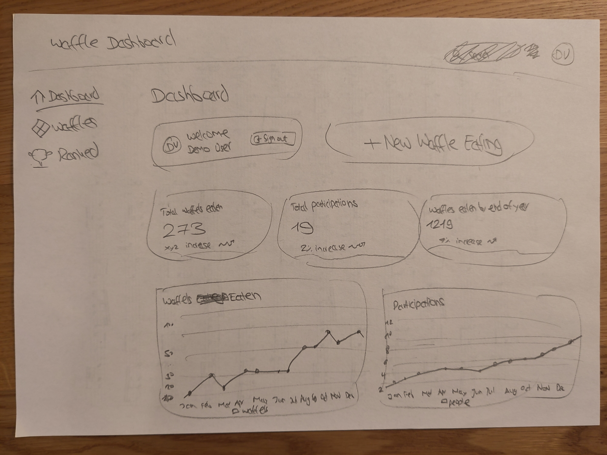
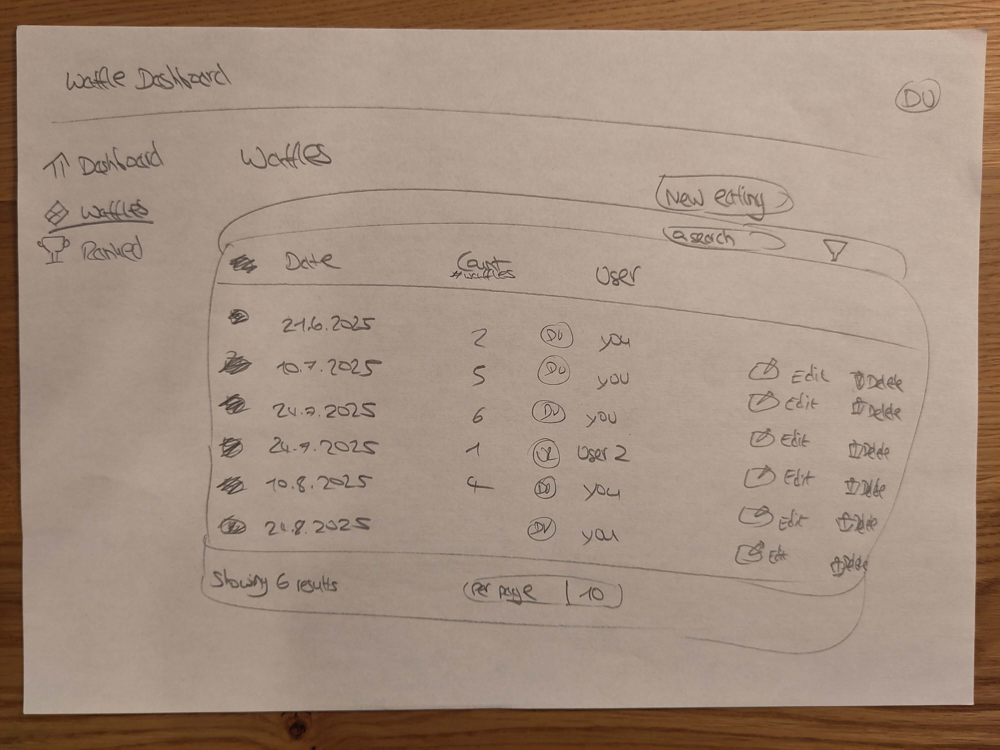
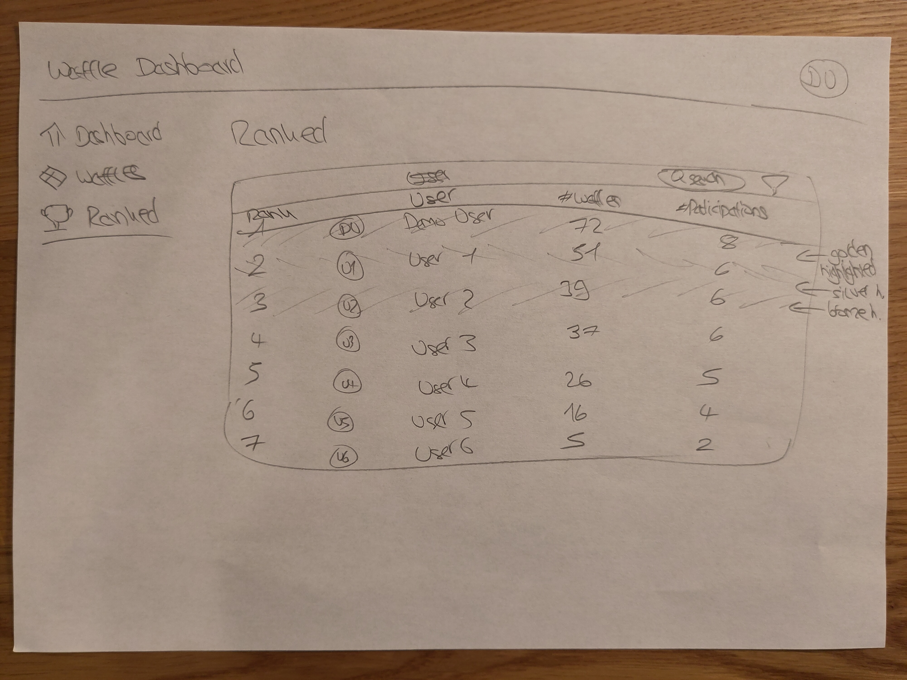
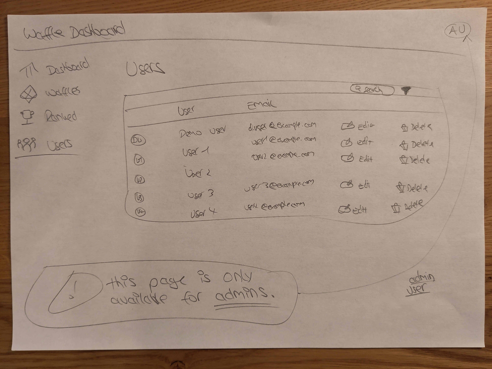
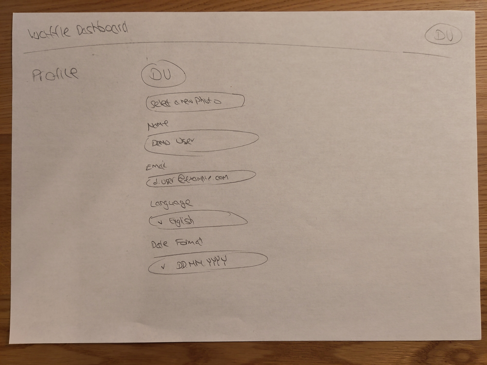

# Design

The system provides five main pages, illustrated in the below mockups.

> Note that I didn't put too much effort into the drawings.
The text or minor details may differ in the end.

## Dashboard – statistics overview and quick waffle entry action

The "+ New Waffle Eating" action button there shall open a modal that offers all the necessary input options to enter a waffle consumption record (for oneself or for another user).

## Waffles – table to view and manage entries

## Leaderboard – ranked list of all users

## Users (Admin) – manage user accounts

## Profile – personal settings

